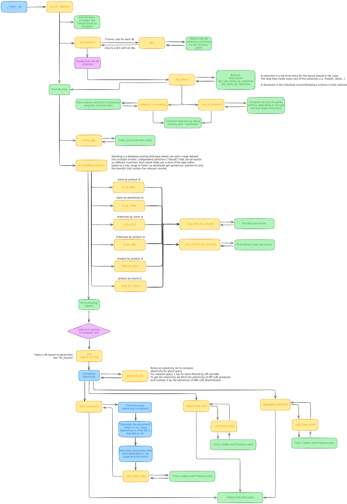

# ESILV Big Data Structure

Toolkit that compares several denormalization strategies for an e-commerce dataset (assignment sections 2.3–2.6), estimates their storage/sharding impact, and now simulates the operators requested in Homeworks 3.3 (filters + nested-loop joins) and 4.2 (aggregations).

## Architecture



The diagram (exported from `assets/architecture.excalidraw`) shows the logical flow used in the report:
1. Start from the source entities (Product, Stock, Warehouse, OrderLine, Client, etc.).
2. Apply the five denormalization patterns (DB1–DB5) to produce candidate document layouts.
3. Feed each layout into the sizing engine to obtain per-document and per-collection footprints.
4. Compare the results and pass the observations to the sharding calculator to reason about key choices.
5. Run the operator simulator (filters, nested loops, aggregates) on concrete queries to estimate output sizes and coarse-grained costs.

## What the tooling computes

- **Denormalized layouts (`src/app/schemas.py`)** – Declarative schemas describe which subdocuments/arrays are embedded for DB1..DB5. Each schema keeps average array cardinalities so the sizing step can stay realistic.
- **Document & collection sizing (`src/app/sizer.py`)** – Recursively sums field sizes using the assignment’s byte budget (e.g., 12 B key overhead, 80 B strings). Multiplying by the base cardinalities from `Stats` yields total GB per collection and per database layout.
- **Qualitative trade-off notes (`src/app/report.py`)** – Each layout comes with a short rationale summarizing the pros/cons of the chosen denormalization.
- **Sharding calculator (`src/app/sharding.py`)** – Given the same dataset and an infrastructure with 1,000 servers, it evaluates average docs/server and distinct key values/server for shard keys such as `Stock#IDP`, `OrderLine#IDC`, or `Product#brand`.
- **Operator simulator (`src/app/operators.py`)** – Implements the four operators requested in Homework 3.3 (filter with/without sharding, nested loop with/without sharding) plus the aggregate operators from Homework 4.2. Each operator reports:
  - Output row count and size (respecting projections)
  - Bytes scanned
  - Shards touched
  - Time/carbon/price proxies (simple linear model; see below)
- **Reporting harness (`src/app/report.py`)** – Runs sizing, sharding, and the operator simulations on the provided practice queries (Q1–Q7) using layout DB1 for concreteness.

## Repository layout

```
.
├── assets/
│   ├── architecture.excalidraw   # editable drawing
│   └── architecture.svg          # exported diagram referenced in this README
└── src/app/
    ├── __main__.py               # entrypoint that runs the full report
    ├── constants.py              # dataset statistics and byte-size constants
    ├── schemas.py                # DB1–DB5 layouts
    ├── sizer.py                  # recursive sizing helpers
    ├── sharding.py               # shard key scenarios
    ├── operators.py              # filter/join/aggregate operators and cost model
    └── report.py                 # orchestrates the end-to-end output
```

## Running the report

Requirements: Python 3.10+ and only the standard library.

```
PYTHONPATH=src python3 -m app
```

Sample output excerpt:

```
================================================================================
STEP 2.3–2.5: Denormalizations, Document Sizes, Collection Sizes, DB Sizes
================================================================================

DB1
--------------------------------------------------------------------------------
Average Document Size (bytes):
    Product      : 1,152 B
    Stock        : 152 B
    ...
Total Database Size (GB): 886.875 GB

Denormalization tradeoffs (quick notes):
    - Joins still needed for Stock/OrderLine searches; Product hot, but Stock separate.
================================================================================
STEP 2.6: Sharding Strategies - Averages per Server
================================================================================
St - #IDP    | Coll=Stock      | docs/server=20,000.0 | distinct-values/server=100.000
St - #IDW    | Coll=Stock      | docs/server=20,000.0 | distinct-values/server=0.200
OL - #IDC    | Coll=OrderLine  | docs/server=4,000,000.0 | distinct-values/server=10,000.000
...
================================================================================
STEP 3.3: Filter and Nested Loop Operators (examples on DB1)
================================================================================
Q1 filter (Stock by IDP & IDW, sharded) | out=1.0 docs (0.000 GB) | scan=0.000 GB | shards=1 | time=0.002s | carbon=0.000kg | price=$0.000
Q5 nested loop (Apple products distribution) | out=10,000.0 docs (0.002 GB) | scan=0.001 GB | shards=1 | time=0.017s | carbon=0.000kg | price=$0.000
================================================================================
STEP 4.2: Aggregate Operators (examples on DB1)
================================================================================
Q6 aggregate (SUM qty by product, sharded) | out=100,000.0 docs (0.004 GB) | scan=879.169 GB | shards=1000 | time=9.005s | carbon=43.958kg | price=$17.583
```

The full output enumerates every layout (DB1–DB5) and all shard key scenarios.

## How the operator simulator works (Homeworks 3.3 & 4.2)

- **Selectivities** follow the assignment stats (e.g., brand="Apple" hits 50/100 000 products, dates are 1/365, shard keys are uniform). You can override them by passing a different `selectivity` value to the operator functions.
- **Projection sizing** uses the same byte budget as the sizing engine: each projected field’s schema is summed so output sizes reflect the chosen columns.
- **Cost model** (coarse, linear):
  - Read throughput: 100 MB/s; time scales down with shard-level parallelism.
  - Per-shard latency: 2 ms (used to differentiate shard-aware vs. broadcast plans).
  - Carbon: 0.05 kg/GB scanned; Price: $0.02/GB scanned.
- **Operators implemented**:
  1) Filter with sharding awareness (touch one shard if the filter key matches the shard key, otherwise all shards)  
  2) Filter without sharding (single-node/broadcast)  
  3) Nested loop join with sharding (optionally co-located to avoid broadcast)  
  4) Nested loop join without sharding  
  5) Aggregate with sharding (parallel scan/reduce; latency reduced when shard key = group key)  
  6) Aggregate without sharding
- **Queries covered**: the report runs Q1–Q7 from the practice sheet on DB1. For other layouts, call the same operators with a different `DBLayout`.

## Sharding strategy observations

- **Stock#IDP vs Stock#IDW** – Both shard keys distribute the same 20 M stock documents, but `#IDP` yields ~100 distinct products per server while `#IDW` only sees 0.2 warehouses/server, meaning almost every write would pile onto just 200 shards. Product ID therefore keeps load balanced; warehouse ID would cause severe hotspotting.
- **OrderLine#IDC vs OrderLine#IDP** – Order lines are plentiful (4 B docs) and both keys fan out well across 1,000 servers, but `#IDC` carries 10,000 distinct clients/server, delivering better randomness for client-centric queries and reducing the chance two clients lock the same shard. `#IDP` remains viable for product analytics, yet the 100 values/server signal a mild skew risk for very popular items.
- **Product#IDP vs Product#brand** – With only 100 products/server, both keys keep shard sizes tiny, but `#brand` has just five distinct values/server, so a few high-volume brands would dominate their shards. Sticking to the primary key keeps uniform distribution and simplifies range-based routing.

## Customizing scenarios

- **Change dataset scale** by editing `Stats` in `src/app/constants.py` (e.g., number of warehouses, brands, or order lines). Derived counts such as `N_STOCK` update automatically.
- **Update average embedded cardinalities** (e.g., order lines per product) via `Averages` in the same file.
- **Add new layouts** by copying one of the `db*` helper functions in `src/app/schemas.py` and registering it inside `all_layouts`.
- **Experiment with infra sizes** by adjusting `Infra.SERVERS` when analyzing sharding strategies.
- **Tweak the cost model** in `src/app/constants.py` (throughput, carbon/price per GB) or adapt `operators.py` if you want to model different join/aggregate shapes.

## Suggested next steps

1. Compare the computed sizes with actual MongoDB explain plans or Atlas size metrics to validate the assumptions.
2. Extend `sharding.py` with more composite keys (e.g., `{brand, warehouse}`) or zone-sharding rules to study skew mitigation.
3. Hook the sizing logic into a lightweight CLI (Typer/argparse) to let teammates pick layouts and stats directly from the command line.
